# 📊 Cloud Krishna - Visual Documentation

> Complete visual guide to understand the project architecture, data flow, and system interactions

## 🏗️ System Architecture Overview

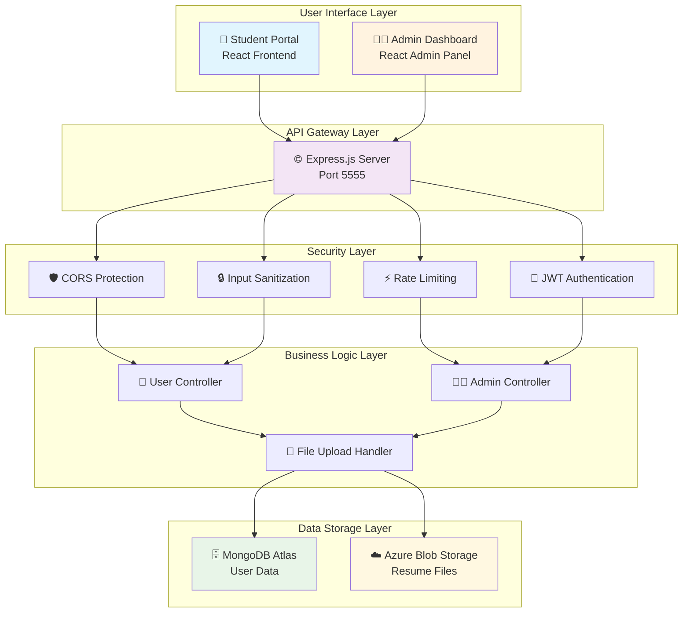

## 🔄 User Registration Flow

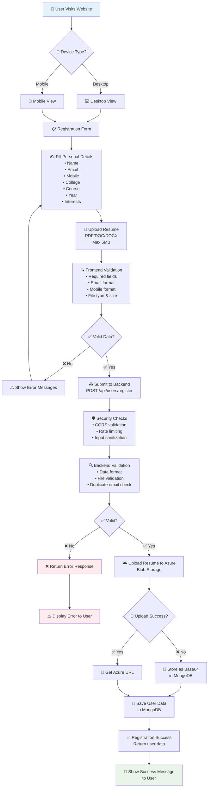

## 👨‍💼 Admin Dashboard Flow

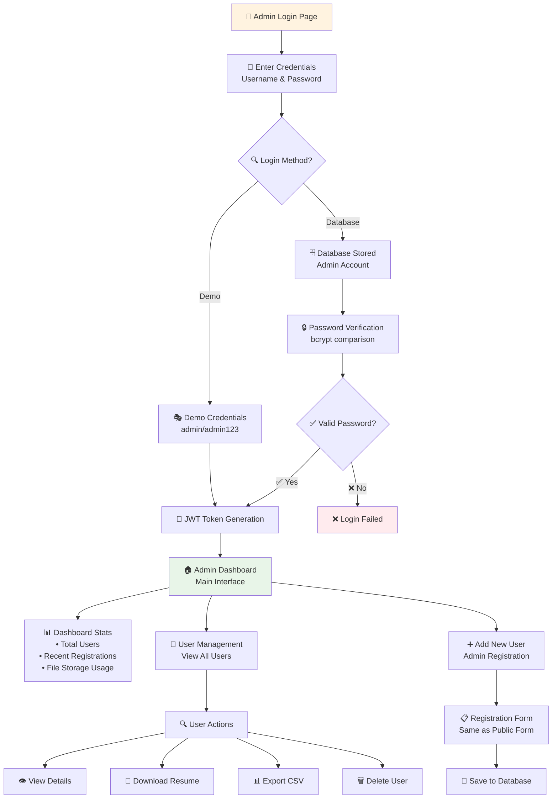

## 🔒 Security Implementation Flow

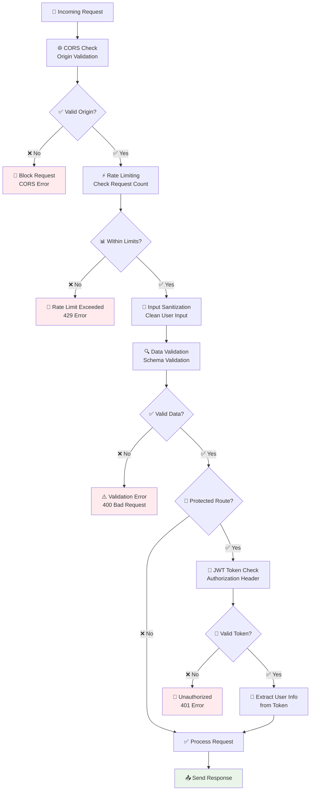

## 📁 File Upload Process

```mermaid
flowchart TD
    A[📎 User Selects File] --> B[🔍 Frontend Validation<br/>• File type (PDF/DOC/DOCX)<br/>• File size (max 5MB)<br/>• File exists]
    
    B --> C{✅ Valid File?}
    C -->|❌ No| D[⚠️ Show Error Message<br/>Invalid file type/size]
    
    C -->|✅ Yes| E[📤 Upload to Backend<br/>Multipart Form Data]
    
    E --> F[🛡️ Backend File Validation<br/>• MIME type check<br/>• File content scan<br/>• Size verification]
    
    F --> G{🔍 File Safe?}
    G -->|❌ No| H[🚫 Reject File<br/>Security threat detected]
    
    G -->|✅ Yes| I[☁️ Upload to Azure<br/>Blob Storage]
    
    I --> J{📁 Azure Upload?}
    J -->|✅ Success| K[🔗 Get Azure URL<br/>Public accessible link]
    J -->|❌ Failed| L[💾 Convert to Base64<br/>Store in MongoDB]
    
    K --> M[💾 Save URL in Database<br/>User record updated]
    L --> N[💾 Save Base64 in Database<br/>User record updated]
    
    M --> O[✅ Upload Complete<br/>Success response]
    N --> O
    
    style D fill:#ffebee
    style H fill:#ffebee
    style O fill:#e8f5e8
```

## 🗄️ Database Schema Structure

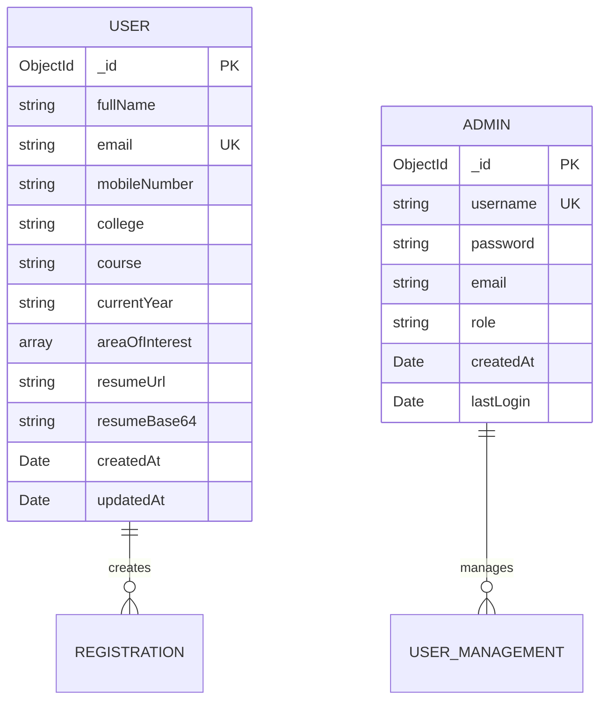

## 🌐 API Endpoints Structure

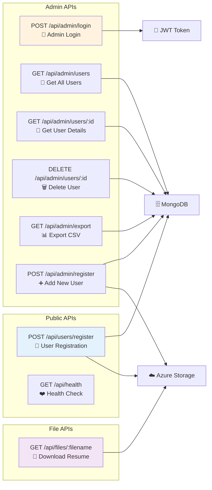

## 🚀 Deployment Architecture

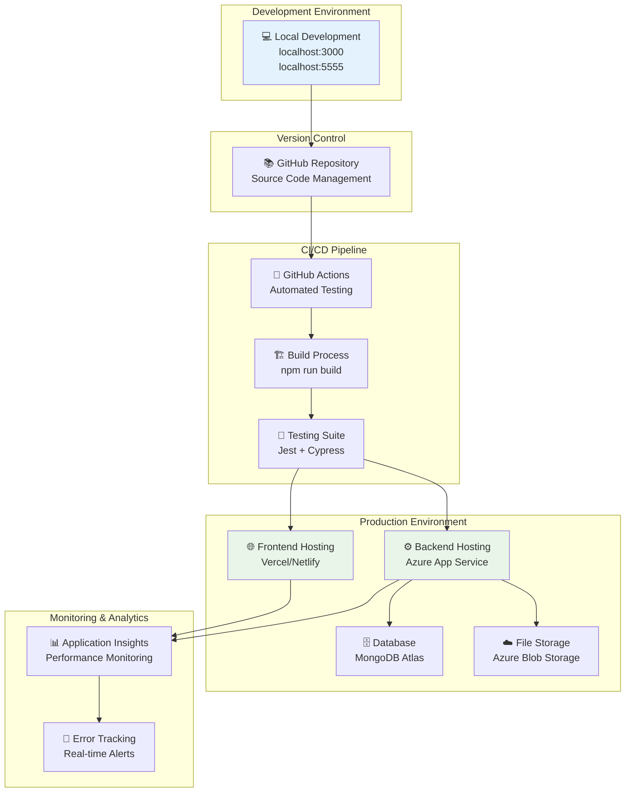

## 📱 User Interface Flow

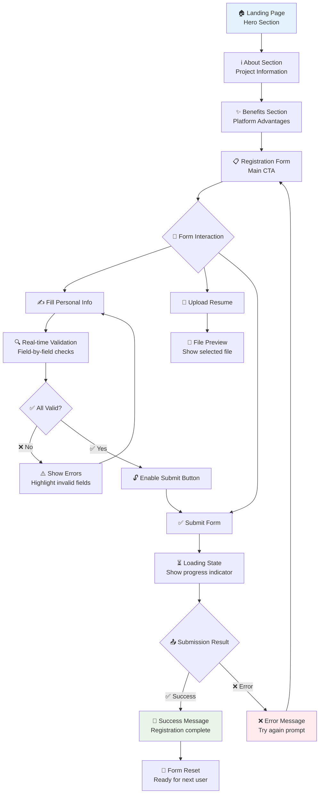

## 🔧 Admin Dashboard Interface

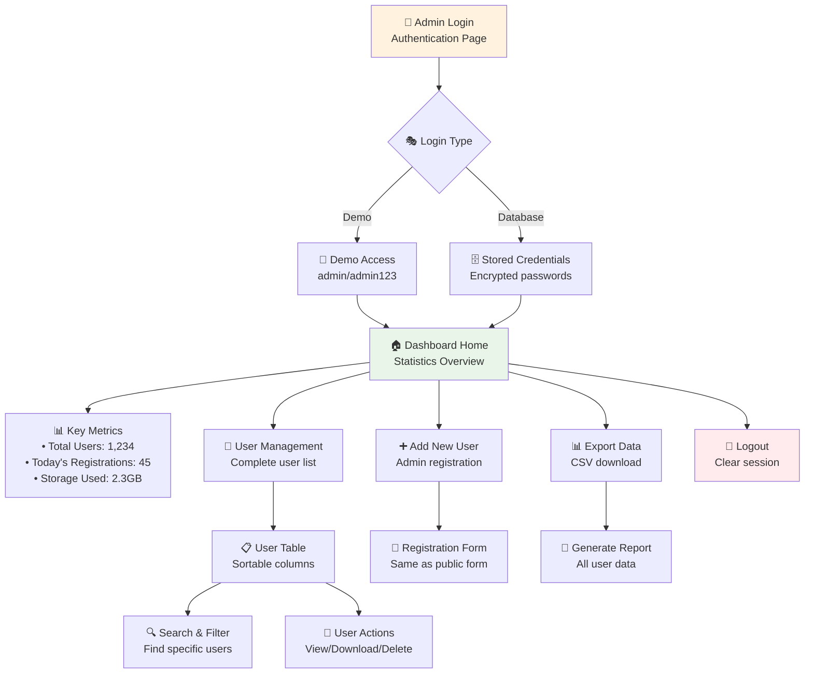

## 🔄 Data Flow Diagram

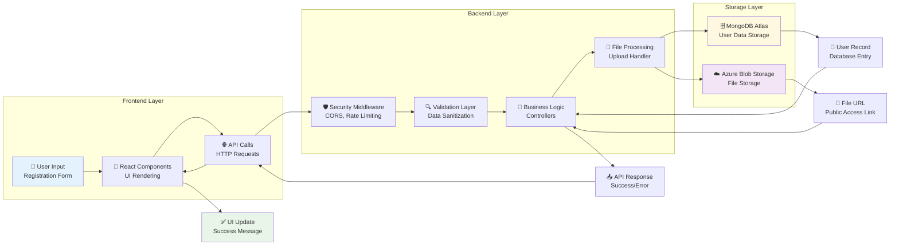

## 🎯 Key Features Visual Map

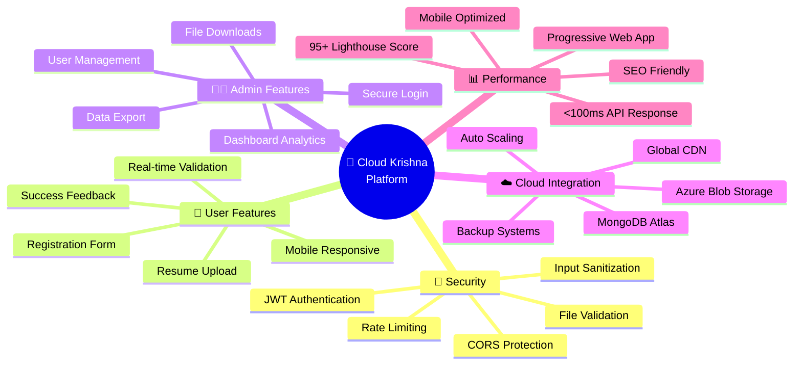

## 🚀 Technology Stack Visual

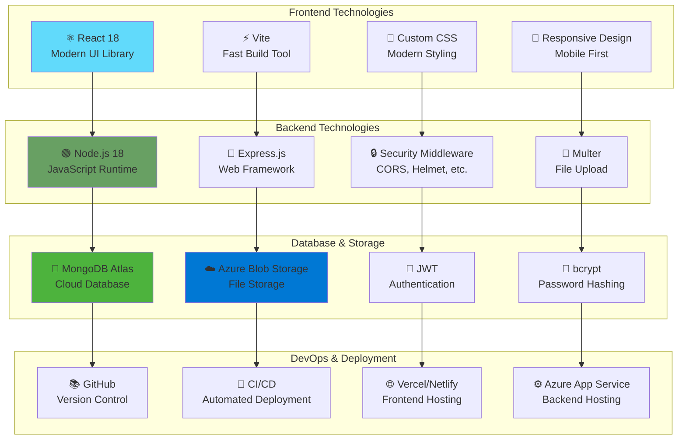

---

## 📋 Visual Summary

This visual documentation provides:

- **🏗️ Complete Architecture Overview**: How all components connect
- **🔄 Process Flows**: Step-by-step user and admin journeys  
- **🔒 Security Implementation**: Multi-layer protection system
- **📁 File Upload Process**: Secure file handling workflow
- **🗄️ Database Structure**: Data relationships and schema
- **🌐 API Organization**: Endpoint structure and flow
- **🚀 Deployment Pipeline**: From development to production
- **📱 User Interface Flow**: Frontend user experience
- **🔧 Admin Dashboard**: Administrative functionality
- **🔄 Data Flow**: Information movement through system
- **🎯 Feature Mapping**: All platform capabilities
- **🚀 Technology Stack**: Complete tech ecosystem

Each diagram is designed to be **easily understood by anyone** - from developers to stakeholders to end users. The visual approach makes complex technical concepts accessible and provides a clear understanding of how Cloud Krishna works as a complete system.